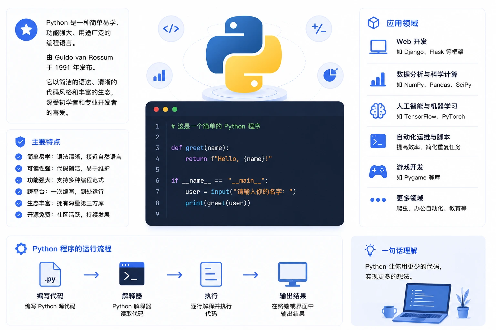
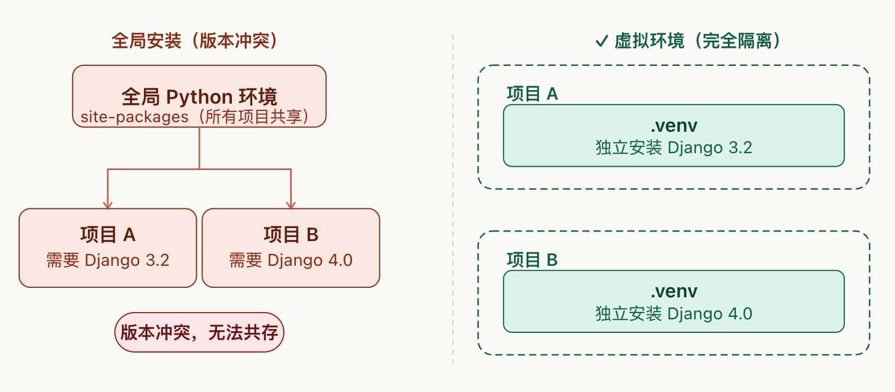
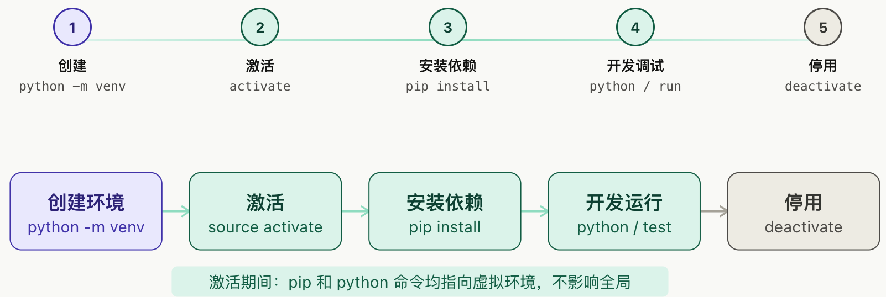

# Python

+ Python 是一种解释型语言： 这意味着开发过程中没有了编译这个环节。类似于PHP和Perl语言。

+ Python 是交互式语言： 这意味着，您可以在一个 Python 提示符 >>> 后直接执行代码。

+ Python 是面向对象语言: 这意味着Python支持面向对象的风格或代码封装在对象的编程技术。

+ Python 是初学者的语言：Python 对初级程序员而言，是一种伟大的语言，它支持广泛的应用程序开发，从简单的文字处理到 WWW 浏览器再到游戏。



# python 安装

+ https://www.python.org/

+ windows 平台

+ linux 平台
```text
# tar -zxvf Python-3.6.1.tgz
# cd Python-3.6.1
# ./configure
# make && make install
```
# Python & vscode 

+ https://code.visualstudio.com/


# python 虚拟环境

+ 1.创建一个虚拟环境
```
D:\>mkdir test_venv
D:\>cd test_venv
D:\test_venv>python -m venv test


注意命令python -m venv test,创建一个test的虚拟环境，生成目录形式如下：
test
  │  pyvenv.cfg
  ├─Include
  ├─Lib
  └─Scripts
```
+ 2.启用虚拟环境
```
D:\test_venv>test\Scripts\activate.bat
(test) D:\test_venv>

执行那个activate.bat文件，启用后，提示符前面会出现虚拟环境的名字(test)。
```

+ 3.pip在虚拟环境安装模块
```
(test) D:\test_venv>pip list
```

+ 4.退出虚拟环境
```
(test) D:\test_venv>test\Scripts\deactivate.bat
```


# pip 包管理工具

+ 源
```
阿里云：https://mirrors.aliyun.com/pypi/simple/
豆瓣：https://pypi.douban.com/simple/
清华大学：https://pypi.tuna.tsinghua.edu.cn/simple/
中国科学技术大学  http://pypi.mirrors.ustc.edu.cn/simple/
```

+ 1、临时更换镜像源
  + pip3 install 库名 -i 镜像地址


+ 2、一次配置，永久使用。
```
Windows环境。
打开我的电脑，在地址栏中输入 %HOMEPATH% 按回车跳转到目标目录。在目录下创建一个pip文件夹，再其内部创建一个pip.ini 文件。输入以下信息。以阿里云为例
[global]
timeout = 6000 
index-url = https://mirrors.aliyun.com/pypi/simple/
trusted-host = mirrors.aliyun.com

Linux 或者Mac环境：
在 ~/.pip/pip.conf 这个目录(没有自己创建一个)将上面的配置信息，进行修改保存即

pip.ini 文件的设置
[global]
timeout =6000
index-url = http://32.13.23.198:8081/repository/hmpypi-group/simple/
trusted-host = 32.13.23.198

```

+ 3 离线
```
离线下载安装包
下载单个离线包 - pip download -d your_offline_packages <package_name>
批量下载离线包 - pip download -d your_offline_packages -r requirements.txt
 离线安装
安装单个离线包 - pip install --no-index --find-links=/your_offline_packages/ package_name
批量安装离线包 - pip install --no-index --find-links=/your_offline_packages/ -r requirements.txt
```
+ 4 pip 命令

|  说明   | 命令  |
|  ----  | ----  |
| 安装包  |  pip install  安装包名 |
| 卸载包  |  pip uninsatll 安装包名 |
| 列出清单  |  pip list |
| 根据依赖文件安装软件包  |  pip freeze > requirements.txt	 使用pip导出依赖文件列表 pip install -r requirements.txt 根据依赖文件列表，自动安装对应的软件包 |
| 配置  |  pip config list |
| 显示某包的信息  |  pip show 安装包名 |