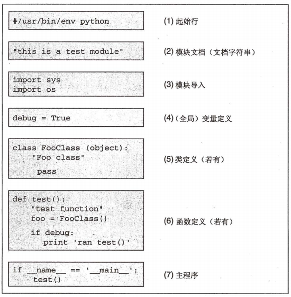
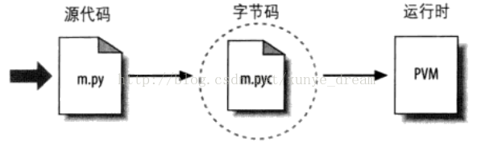

步骤：
1、将.py文件中的语句编译成字节码（字节指令）【.pyc】
2、转发给“Python虚拟机（PVM）”。

“Python在写好后可以立即运行。”
这里的字节码不是二进制代码，是Python的一种表现形式。

# 有且只能有一个main主函数, 代码从 main() 函数开始执行

# Python是解释性语言，不需要先编译成二进制语言，再执行。Python是动态，是从上至下逐行解释运行。只要有正确的代码，python便可以执行该文件

