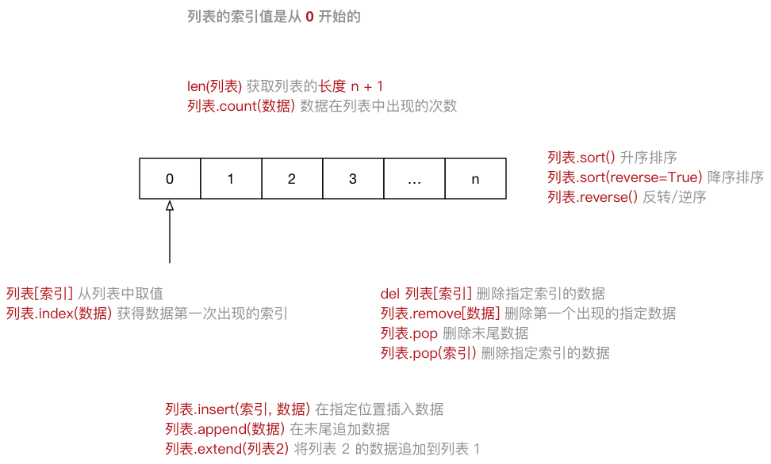
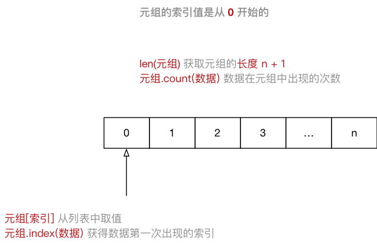
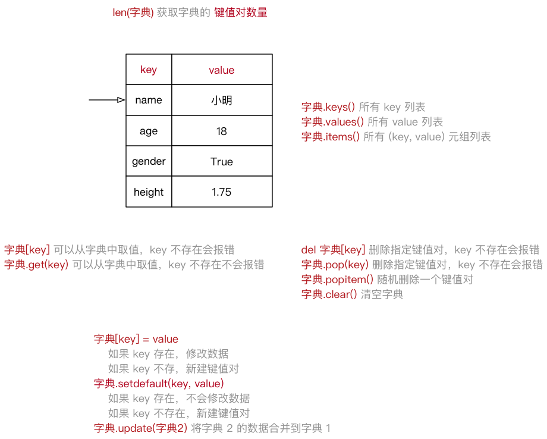
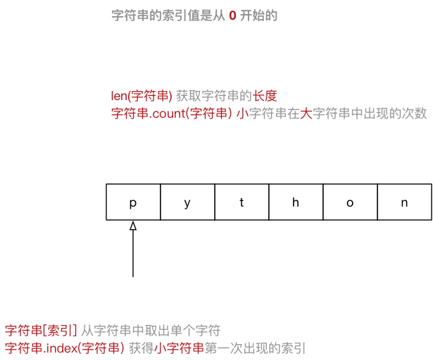
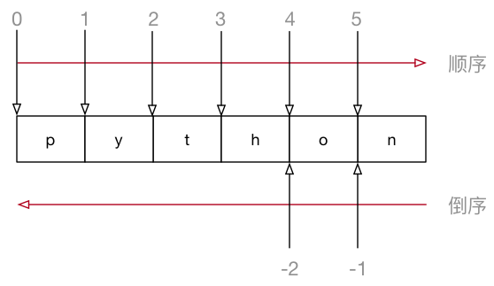
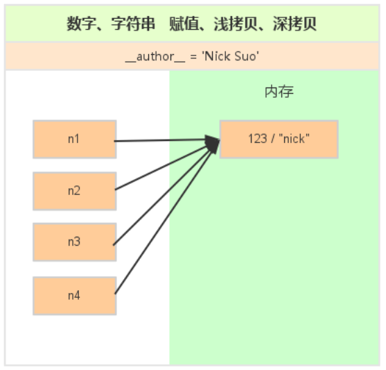
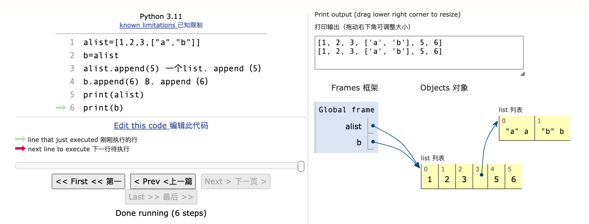
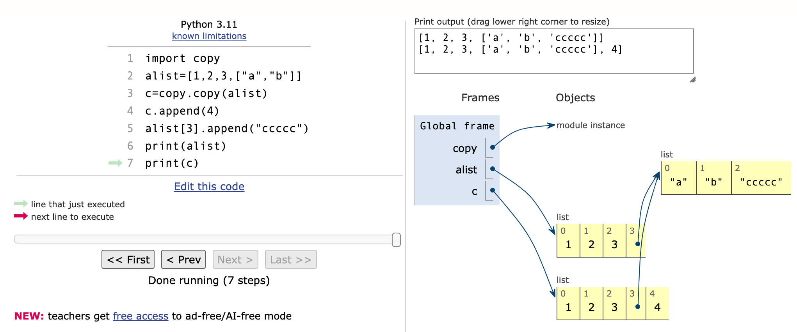
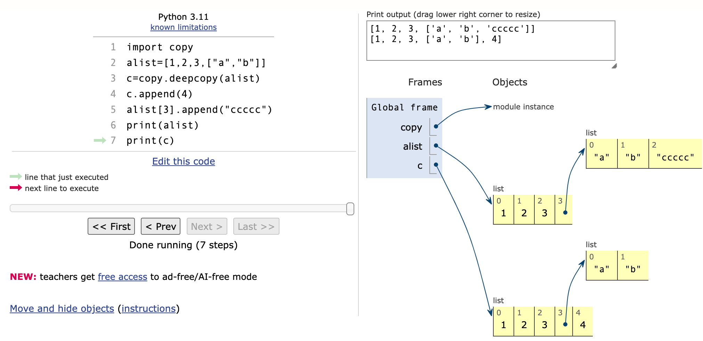

+ 数据类型
    + 在 Python 中定义变量是 不需要指定类型（在其他很多高级语言中都需要），Python 可以根据 = 等号右侧的值，自动推导出变量中存储数据的类型
```
数据类型可以分为 数字型 和 非数字型
数字型
    整型 (int)：Python3中的所有整数都表示为长整数。 因此，长整数没有单独的数字类型。
    浮点型（float）
    布尔型（bool） ：真 True 非 0 数 —— 非零即真，假 False 0。
    复数型 (complex)：复数是由x + yj表示的有序对的实数浮点数组成，其中x和y是实数，j是虚数单位。
非数字型：有些运算符还支持这些数据类型。
    字符串（str）：加号(+)是字符串连接运算符，星号(*)是重复运算符。
    列表（list）
    元组（tuple）
    字典（dict）
```

## 列表（list）
+ List（列表） 是 Python 中使用 最频繁 的数据类型，在其他语言中通常叫做 数组，专门用于存储 一串 信息，列表用 [] 定义，数据 之间使用 , 分隔，列表的 索引 从 0 开始。



## 元组（tuple）
+ Tuple（元组）与列表类似，不同之处在于元组的 元素不能修改
    + 元组 表示多个元素组成的序列
    + 元组 在 Python 开发中，有特定的应用场景
        + 用于存储 一串 信息，数据 之间使用 , 分隔
    + 元组用 () 定义，元组的 索引 从 0 开始，索引 就是数据在 元组 中的位置编号。



## 字典（dict）

+ dict（字典） 是 除列表以外 Python 之中 最灵活 的数据类型。字典同样可以用来 存储多个数据，通常用于存储 描述一个 物体 的相关信息

+ 和列表的区别：
    + 列表 是 有序 的对象集合
    + 字典 是 无序 的对象集合

+ 字典用 {} 定义。字典使用 键值对 存储数据，键值对之间使用逗号 , 分隔：
    + 键 key 是索引
    + 值 value 是数据
    + 键 和 值 之间使用冒号 : 分隔
    + 键必须是唯一的
    + 值 可以取任何数据类型，但 键 只能使用 字符串、数字或 元组



## 字符串（str）
+ 字符串 就是 一串字符，是编程语言中表示文本的数据类型
+ 在 Python 中可以使用 一对双引号 " 或者 一对单引号 ' 定义一个字符串
    + 虽然可以使用 \" 或者 \' 做字符串的转义，但是在实际开发中：
    + 如果字符串内部需要使用 "，可以使用 ' 定义字符串
    + 如果字符串内部需要使用 '，可以使用 " 定义字符串
+ 可以使用 索引 获取一个字符串中 指定位置的字符，索引计数从 0 开始
+ 也可以使用 for 循环遍历 字符串中每一个字符



## 切片

+ 切片 方法适用于 字符串、列表、元组
    + 切片 使用 索引值 来限定范围，从一个大的 字符串 中 切出 小的 字符串
    + 列表 和 元组 都是 有序 的集合，都能够 通过索引值 获取到对应的数据
    + 字典 是一个 无序 的集合，是使用 键值对 保存数据



+ 字符串[开始索引:结束索引:步长]

    + 指定的区间属于 左闭右开 型 [开始索引, 结束索引) => 开始索引 <= 范围 < 结束索引
    + 从 起始 位开始，到 结束位的前一位 结束（不包含结束位本身)
    + 从头开始，开始索引 数字可以省略，冒号不能省略
    + 到末尾结束，结束索引 数字可以省略，冒号不能省略
    + 步长默认为 1，如果连续切片，数字和冒号都可以省略

```python
num_str = "0123456789"

print(num_str[2:6]) # 1. 截取从 2 ~ 5 位置 的字符串
print(num_str[2:])  # 2. 截取从 2 ~ `末尾` 的字符串
print(num_str[:6])  # 3. 截取从 `开始` ~ 5 位置 的字符串
print(num_str[:])   # 4. 截取完整的字符串
print(num_str[::2]) # 5. 从开始位置，每隔一个字符截取字符串
print(num_str[1::2]) # 6. 从索引 1 开始，每隔一个取一个

# 倒序切片
print(num_str[-1]) # -1 表示倒数第一个字符
print(num_str[2:-1])# 7. 截取从 2 ~ `末尾 - 1` 的字符串
print(num_str[-2:])# 8. 截取字符串末尾两个字符
print(num_str[::-1])# 9. 字符串的逆序（面试题）
```

## 变量引用
+ 在 Python 中：变量 和 数据 是分开存储的，数据 保存在内存中的一个位置，变量 中保存着数据在内存中的地址，就叫做 引用，使用 id() 函数可以查看变量中保存数据所在的 内存地址。
+ 注意：如果变量已经被定义，当给一个变量赋值的时候，本质上是 修改了数据的引用
    + 变量 不再 对之前的数据引用
    + 变量 改为 对新赋值的数据引用

+ 在 Python 中，函数的 实参/返回值 都是是靠 引用 来传递来的

### 可变和不可变类型
+ 不可变类型，内存中的数据不允许被修改：
    + 数字类型 int, bool, float, complex, long(2.x)
    + 字符串 str
    + 元组 tuple
+ 可变类型，内存中的数据可以被修改：
    + 列表 list
    + 字典 dict
    + 集合 set
        + 注意：字典的 key 只能使用不可变类型的数据

+ 不可变数据类型： 当该数据类型的对应变量的值发生了改变，那么它对应的内存地址也会发生改变，对于这种数据类型，就称不可变数据类型。
+ 可变数据类型 ：当该数据类型的对应变量的值发生了改变，那么它对应的内存地址不发生改变，对于这种数据类型，就称可变数据类型。
+ 总结：不可变数据类型更改后地址发生改变，可变数据类型更改地址不发生改变

```python
import copy
#定义变量   数字、字符串
n1 = 123
#n1 = 'nick'
print(id(n1))

#赋值
n2 = n1
print(id(n2))
 
#浅拷贝
n3 = copy.copy(n1)
print(id(n3))
 
#深拷贝
n4 = copy.deepcopy(n1)
print(id(n4))
```



+ 1、赋值
    + 创建一个变量，该变量指向原来内存地址 直接赋值,默认浅拷贝传递对象的引用而已,原始列表改变，被赋值的b也会做相同的改变



+ 2、浅拷贝
    + 在内存中只额外创建第一层数据 当修改列表之后（copy浅拷贝，没有拷贝子对象，所以原始数据改变，子对象会改变） 



+ 3、深拷贝
    + 在内存中将所有的数据重新创建一份（排除最后一层，即：python内部对字符串和数字的优化） 当修改列表之后（深拷贝，包含对象里面的自对象的拷贝，所以原始对象的改变不会造成深拷贝里任何子元素的改变） 



###  局部变量和全局变量
+ 局部变量 是在 函数内部 定义的变量，只能在函数内部使用；函数执行结束后，函数内部的局部变量，会被系统回收；不同的函数，可以定义相同的名字的局部变量，但是 彼此之间 不会产生影响；局部变量一般临时 保存 函数内部需要使用的数据。
+ 全局变量 是在 函数外部定义 的变量（没有定义在某一个函数内），所有函数 内部 都可以使用这个变量。