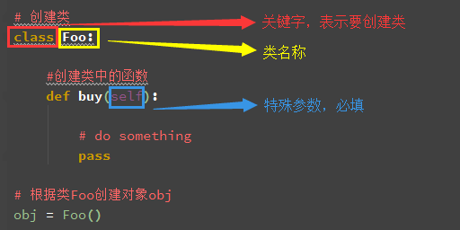
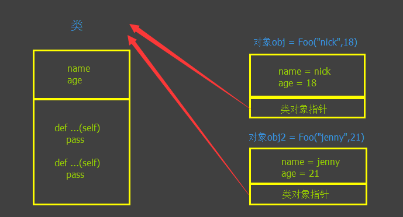

## 面向对象技术简介
+ 类(Class): 用来描述具有相同的属性和方法的对象的集合。它定义了该集合中每个对象所共有的属性和方法。对象是类的实例。
+ 方法：类中定义的函数。
+ 类变量：类变量在整个实例化的对象中是公用的。类变量定义在类中且在函数体之外。类变量通常不作为实例变量使用。
+ 数据成员：类变量或者实例变量用于处理类及其实例对象的相关的数据。
+ 方法重写：如果从父类继承的方法不能满足子类的需求，可以对其进行改写，这个过程叫方法的覆盖（override），也称为方法的重写。
+ 局部变量：定义在方法中的变量，只作用于当前实例的类。
+ 实例变量：在类的声明中，属性是用变量来表示的，这种变量就称为实例变量，实例变量就是一个用 self 修饰的变量。
+ 继承：即一个派生类（derived class）继承基类（base class）的字段和方法。继承也允许把一个派生类的对象作为一个基类对象对待。例如，有这样一个设计：一个Dog类型的对象派生自Animal类，这是模拟"是一个（is-a）"关系（例图，Dog是一个Animal）。
+ 实例化：创建一个类的实例，类的具体对象。
+ 对象：通过类定义的数据结构实例。对象包括两个数据成员（类变量和实例变量）和方法。

### 类定义
语法格式如下：
```
class ClassName:
    <statement-1>
    .
    .
    .
    <statement-N>
```
类实例化后，可以使用其属性，实际上，创建一个类之后，可以通过类名访问其属性。


### 类对象
类对象支持两种操作：属性引用和实例化。

属性引用使用和 Python 中所有的属性引用一样的标准语法：obj.name。

类对象创建后，类命名空间中所有的命名都是有效属性名。所以如果类定义是这样:

```python

#!/usr/bin/python3
 
class MyClass:
    """一个简单的类实例"""
    i = 12345
    def f(self):
        return 'hello world'

# 实例化类
x = MyClass()
 
# 访问类的属性和方法
print("MyClass 类的属性 i 为：", x.i)
print("MyClass 类的方法 f 输出为：", x.f())
```
以上创建了一个新的类实例并将该对象赋给局部变量 x，x 为空的对象。

执行以上程序输出结果为：
```
MyClass 类的属性 i 为： 12345
MyClass 类的方法 f 输出为： hello world
```
类有一个名为 __init__() 的特殊方法（构造方法），该方法在类实例化时会自动调用，像下面这样：
```
def __init__(self):
    self.data = []
```
类定义了 __init__() 方法，类的实例化操作会自动调用 __init__() 方法。如下实例化类 MyClass，对应的 __init__() 方法就会被调用:
```
x = MyClass()
```
当然， __init__() 方法可以有参数，参数通过 __init__() 传递到类的实例化操作上。例如:

```python
#!/usr/bin/python3
 
class Complex:
    def __init__(self, realpart, imagpart):
        self.r = realpart
        self.i = imagpart
x = Complex(3.0, -4.5)
print(x.r, x.i)   # 输出结果：3.0 -4.5
```
### self 代表类的实例，而非类
类的方法与普通的函数只有一个特别的区别——它们必须有一个额外的第一个参数名称, 按照惯例它的名称是 self。
```python
class Test:
    def prt(self):
        print(self)
        print(self.__class__)
 
t = Test()
t.prt()
```
以上实例执行结果为：
```
<__main__.Test instance at 0x100771878>
__main__.Test
```
从执行结果可以很明显的看出，self 代表的是类的实例，代表当前对象的地址，而 self.class 则指向类。

self 不是 python 关键字，我们把他换成 runoob 也是可以正常执行的:
```python
class Test:
    def prt(runoob):
        print(runoob)
        print(runoob.__class__)
 
t = Test()
t.prt()
```
以上实例执行结果为：
```
<__main__.Test instance at 0x100771878>
__main__.Test
```
在 Python中，self 是一个惯用的名称，用于表示类的实例（对象）自身。它是一个指向实例的引用，使得类的方法能够访问和操作实例的属性。

当你定义一个类，并在类中定义方法时，第一个参数通常被命名为 self，尽管你可以使用其他名称，但强烈建议使用 self，以保持代码的一致性和可读性。

```python
class MyClass:
    def __init__(self, value):
        self.value = value

    def display_value(self):
        print(self.value)

# 创建一个类的实例
obj = MyClass(42)

# 调用实例的方法
obj.display_value() # 输出 42
```
在上面的例子中，self 是一个指向类实例的引用，它在 __init__ 构造函数中用于初始化实例的属性，也在 display_value 方法中用于访问实例的属性。通过使用 self，你可以在类的方法中访问和操作实例的属性，从而实现类的行为。



### 类的方法
在类的内部，使用 def 关键字来定义一个方法，与一般函数定义不同，类方法必须包含参数 self, 且为第一个参数，self 代表的是类的实例。

```python
#!/usr/bin/python3
 
#类定义
class people:
    #定义基本属性
    name = ''
    age = 0
    #定义私有属性,私有属性在类外部无法直接进行访问
    __weight = 0
    #定义构造方法
    def __init__(self,n,a,w):
        self.name = n
        self.age = a
        self.__weight = w
    def speak(self):
        print("%s 说: 我 %d 岁。" %(self.name,self.age))
 
# 实例化类
p = people('runoob',10,30)
p.speak()
```
执行以上程序输出结果为：
```
runoob 说: 我 10 岁。
```
### 继承
Python 同样支持类的继承，如果一种语言不支持继承，类就没有什么意义。派生类的定义如下所示:
```
class DerivedClassName(BaseClassName):
    <statement-1>
    .
    .
    .
    <statement-N>
```
子类（派生类 DerivedClassName）会继承父类（基类 BaseClassName）的属性和方法。

BaseClassName（实例中的基类名）必须与派生类定义在一个作用域内。除了类，还可以用表达式，基类定义在另一个模块中时这一点非常有用:
```
class DerivedClassName(modname.BaseClassName):
```
```python
#!/usr/bin/python3
 
#类定义
class people:
    #定义基本属性
    name = ''
    age = 0
    #定义私有属性,私有属性在类外部无法直接进行访问
    __weight = 0
    #定义构造方法
    def __init__(self,n,a,w):
        self.name = n
        self.age = a
        self.__weight = w
    def speak(self):
        print("%s 说: 我 %d 岁。" %(self.name,self.age))
 
#单继承示例
class student(people):
    grade = ''
    def __init__(self,n,a,w,g):
        #调用父类的构函
        people.__init__(self,n,a,w)
        self.grade = g
    #覆写父类的方法
    def speak(self):
        print("%s 说: 我 %d 岁了，我在读 %d 年级"%(self.name,self.age,self.grade))
 
 
 
s = student('ken',10,60,3)
s.speak()
```
执行以上程序输出结果为：
```
ken 说: 我 10 岁了，我在读 3 年级
```
### 多继承
Python同样有限的支持多继承形式。多继承的类定义形如下例:
```
class DerivedClassName(Base1, Base2, Base3):
    <statement-1>
    .
    .
    .
    <statement-N>
```
需要注意圆括号中父类的顺序，若是父类中有相同的方法名，而在子类使用时未指定，python从左至右搜索 即方法在子类中未找到时，从左到右查找父类中是否包含方法。

```python
#!/usr/bin/python3
 
#类定义
class people:
    #定义基本属性
    name = ''
    age = 0
    #定义私有属性,私有属性在类外部无法直接进行访问
    __weight = 0
    #定义构造方法
    def __init__(self,n,a,w):
        self.name = n
        self.age = a
        self.__weight = w
    def speak(self):
        print("%s 说: 我 %d 岁。" %(self.name,self.age))
 
#单继承示例
class student(people):
    grade = ''
    def __init__(self,n,a,w,g):
        #调用父类的构函
        people.__init__(self,n,a,w)
        self.grade = g
    #覆写父类的方法
    def speak(self):
        print("%s 说: 我 %d 岁了，我在读 %d 年级"%(self.name,self.age,self.grade))
 
#另一个类，多继承之前的准备
class speaker():
    topic = ''
    name = ''
    def __init__(self,n,t):
        self.name = n
        self.topic = t
    def speak(self):
        print("我叫 %s，我是一个演说家，我演讲的主题是 %s"%(self.name,self.topic))
 
#多继承
class sample(speaker,student):
    a =''
    def __init__(self,n,a,w,g,t):
        student.__init__(self,n,a,w,g)
        speaker.__init__(self,n,t)
 
test = sample("Tim",25,80,4,"Python")
test.speak()   #方法名同，默认调用的是在括号中参数位置排前父类的方法
```
执行以上程序输出结果为：
```
我叫 Tim，我是一个演说家，我演讲的主题是 Python
```
### 方法重写
如果你的父类方法的功能不能满足你的需求，你可以在子类重写你父类的方法，实例如下：

```python
#!/usr/bin/python3
 
class Parent:        # 定义父类
   def myMethod(self):
      print ('调用父类方法')
 
class Child(Parent): # 定义子类
   def myMethod(self):
      print ('调用子类方法')
 
c = Child()          # 子类实例
c.myMethod()         # 子类调用重写方法
super(Child,c).myMethod() #用子类对象调用父类已被覆盖的方法
super() 函数是用于调用父类(超类)的一个方法。
```
执行以上程序输出结果为：
```
调用子类方法
调用父类方法
```

如果在子类中需要父类的构造方法就需要显式地调用父类的构造方法，或者不重写父类的构造方法。

子类不重写 __init__，实例化子类时，会自动调用父类定义的 __init__。

```python
class Father(object):
    def __init__(self, name):
        self.name=name
        print ( "name: %s" %( self.name) )
    def getName(self):
        return 'Father ' + self.name
 
class Son(Father):
    def getName(self):
        return 'Son '+self.name
 
if __name__=='__main__':
    son=Son('runoob')
    print ( son.getName() )
```
输出结果为：
```
name: runoob
Son runoob
```
如果重写了__init__ 时，实例化子类，就不会调用父类已经定义的 __init__，语法格式如下：

```python
class Father(object):
    def __init__(self, name):
        self.name=name
        print ( "name: %s" %( self.name) )
    def getName(self):
        return 'Father ' + self.name
 
class Son(Father):
    def __init__(self, name):
        print ( "hi" )
        self.name =  name
    def getName(self):
        return 'Son '+self.name
 
if __name__=='__main__':
    son=Son('runoob')
    print ( son.getName() )
```
输出结果为：
```
hi
Son runoob
```
如果重写了__init__ 时，要继承父类的构造方法，可以使用 super 关键字：
```
super(子类，self).__init__(参数1，参数2，....)
```
还有一种经典写法：
```
父类名称.__init__(self,参数1，参数2，...)
```
```python
class Father(object):
    def __init__(self, name):
        self.name=name
        print ( "name: %s" %( self.name))
    def getName(self):
        return 'Father ' + self.name
 
class Son(Father):
    def __init__(self, name):
        super(Son, self).__init__(name)
        print ("hi")
        self.name =  name
    def getName(self):
        return 'Son '+self.name
 
if __name__=='__main__':
    son=Son('runoob')
    print ( son.getName() )
```
输出结果为：
```
name: runoob
hi
Son runoob
```

### 类属性与方法
#### 类的私有属性
__private_attrs：两个下划线开头，声明该属性为私有，不能在类的外部被使用或直接访问。在类内部的方法中使用时 self.__private_attrs。
#### 类的方法
在类的内部，使用 def 关键字来定义一个方法，与一般函数定义不同，类方法必须包含参数 self，且为第一个参数，self 代表的是类的实例。

self 的名字并不是规定死的，也可以使用 this，但是最好还是按照约定使用 self。
#### 类的私有方法
__private_method：两个下划线开头，声明该方法为私有方法，只能在类的内部调用 ，不能在类的外部调用。self.__private_methods。

实例
类的私有属性实例如下：
```python
#!/usr/bin/python3
 
class JustCounter:
    __secretCount = 0  # 私有变量
    publicCount = 0    # 公开变量
 
    def count(self):
        self.__secretCount += 1
        self.publicCount += 1
        print (self.__secretCount)
 
counter = JustCounter()
counter.count()
counter.count()
print (counter.publicCount)
print (counter.__secretCount)  # 报错，实例不能访问私有变量
```
执行以上程序输出结果为：
```
1
2
2
Traceback (most recent call last):
  File "test.py", line 16, in <module>
    print (counter.__secretCount)  # 报错，实例不能访问私有变量
AttributeError: 'JustCounter' object has no attribute '__secretCount'
```
类的私有方法实例如下：

```python
#!/usr/bin/python3
 
class Site:
    def __init__(self, name, url):
        self.name = name       # public
        self.__url = url   # private
 
    def who(self):
        print('name  : ', self.name)
        print('url : ', self.__url)
 
    def __foo(self):          # 私有方法
        print('这是私有方法')
 
    def foo(self):            # 公共方法
        print('这是公共方法')
        self.__foo()
 
x = Site('菜鸟教程', 'www.runoob.com')
x.who()        # 正常输出
x.foo()        # 正常输出
x.__foo()      # 报错
```

```
类的专有方法：
__init__ : 构造函数，在生成对象时调用
__del__ : 析构函数，释放对象时使用
__repr__ : 打印，转换
__setitem__ : 按照索引赋值
__getitem__: 按照索引获取值
__len__: 获得长度
__cmp__: 比较运算
__call__: 函数调用
__add__: 加运算
__sub__: 减运算
__mul__: 乘运算
__truediv__: 除运算
__mod__: 求余运算
__pow__: 乘方
```
#### 运算符重载

Python同样支持运算符重载，我们可以对类的专有方法进行重载，实例如下：

```python
#!/usr/bin/python3
 
class Vector:
   def __init__(self, a, b):
      self.a = a
      self.b = b
 
   def __str__(self):
      return 'Vector (%d, %d)' % (self.a, self.b)
   
   def __add__(self,other):
      return Vector(self.a + other.a, self.b + other.b)
 
v1 = Vector(2,10)
v2 = Vector(5,-2)
print (v1 + v2)
```
以上代码执行结果如下所示:
```
Vector(7,8)
```

### 类的特殊成员

成员名前如果有两个下划线，则表示该成员是私有成员，私有成员只能由类内部调用。
 1. `__doc__`

表示类的描述信息

```python
class Foo:
    """ 描述类信息 """
    def func(self):
        pass
print Foo.__doc__#输出：类的描述信息
```

 2. `__module__ 和  __class__`
+ `__module__` 表示当前操作的对象在那个模块
+ `__class__`  表示当前操作的对象的类是什么

```python
#!/usr/bin/env python
# -*- coding:utf-8 -*-
class C:
    def __init__(self):
        self.name = 'nick'

from lib.aa import C
obj = C()
print(obj.__module__)  # 输出 lib.aa，即：输出模块print obj
print(obj.__class__)   # 输出 lib.aa.C，即：输出类
```
 3. `__init__`
 构造方法，通过类创建对象时，自动触发执行。
```python
class Foo:
    def __init__(self, name):
        self.name = name
        self.age = 18

obj = Foo('nick')     # 自动执行类中的 __init__ 方法
```
 4. `__del__`
析构方法，当对象在内存中被释放时，自动触发执行。
注：此方法一般无须定义，因为Python是一门高级语言，程序员在使用时无需关心内存的分配和释放，因为此工作都是交给Python解释器来执行，所以，析构函数的调用是由解释器在进行垃圾回收时自动触发执行的。

```python
class Foo:
    def __del__(self):
        pass
```
 5. `__call__`
对象后面加括号，触发执行。
注：构造方法的执行是由创建对象触发的，即：对象 = 类名() ；而对于 `__call__` 方法的执行是由对象后加括号触发的，即：对象() 或者 类()()

```python
class Foo:
    def __init__(self):
        print("This is init")

    def __call__(self, *args, **kwargs):
        print("This is call")
        return "CC"

obj = Foo()        # 执行 __init__
obj()              # 执行 __call__
result = Foo()()   # 执行 __call__print(result)
```
 6. `__dict__`
类或对象中的所有成员
```python
class Province:
    country = 'China'
    def __init__(self, name, count):
        self.name = name
        self.count = count
    def func(self, *args, **kwargs):
        print 'func'

obj1 = Province('shangxi',10000)
print(obj1.__dict__).  # 获取 对象obj1 的成员
# 输出：{'count': 10000, 'name': 'shangxi'}
obj2 = Province('shangdong', 3888)
print(obj2.__dict__)   # 获取 对象obj1 的成员
# 输出：{'count': 3888, 'name': 'shangdong'}
```
 7. `__str__`
如果一个类中定义了__str__方法，那么在打印对象时，默认输出该方法的返回值。
```python
class Foo:
    def __str__(self):
        return 'nick'

obj = Foo()print obj# 输出：nick
```
 8. `__getitem__、__setitem__、__delitem__`
用于索引操作，如字典。以上分别表示获取、设置、删除数据
```python
class Foo:
    def __getitem__(self, item):
        print(item)
    def __setitem__(self, key, value):
        print(key, value)
    def __delitem__(self, key):
        print(key)

obj = Foo()

obj["nick"]                     # 自动触发执行 __getitem__
obj["nick"] = "jenny"     # 自动触发执行 __setitem__del obj["nick"]                # 自动触发执行 __delitem__
```
 9. `__getslice__、__setslice__、__delslice__`
该三个方法用于分片操作，如：列表
```python
class Foo(object):
 
    def __getslice__(self, i, j):
        print '__getslice__',i,j
 
    def __setslice__(self, i, j, sequence):
        print '__setslice__',i,j
 
    def __delslice__(self, i, j):
        print '__delslice__',i,j
 
obj = Foo()
 
obj[-1:1]                   # 自动触发执行 __getslice__
obj[0:1] = [11,22,33,44]    # 自动触发执行 __setslice__del obj[0:2]                # 自动触发执行 __delslice__
```
 10. `__iter__`
用于迭代器，之所以列表、字典、元组可以进行for循环，是因为类型内部定义了 `__iter__`
```python
#!/usr/bin/env python
# -*- coding:utf-8 -*-
class Foo(object):

    def __init__(self, sq):
        self.sq = sq

    def __iter__(self):
        return iter(self.sq)

obj = Foo([11,22,33,44])
for i in obj:
    print i

#!/usr/bin/env python
# -*- coding:utf-8 -*-
obj = iter([11,22,33,44])
while True:
    val = obj.next()
    print val
```
 11. `__mro__ 和__slot__`
在解析父类的__init__时，定义解析顺序的是子类的__mro__属性，内容为一个存储要解析类顺序的元组。
```python
class A(object):
    def __init__(self):
        print '    -> Enter A'
        print '    <- Leave A'
class B(A):
    def __init(self):
        print '    -> Enter B'
        # A.__init__(self)
        super(B, self).__init__()
        print '    <- Leave B'
class C(A):
    def __init__(self):
        print "    -> Enter C"
        # A.__init__(self)
        super(C, self).__init__()
        print "    <- Leave C"
class D(B, C):
    def __init__(self):
        print "    -> Enter D"
        # B.__init__(self)
        # C.__init__(self)
        super(D, self).__init__()
        print "    <- Leave D"
if __name__ == "__main__":
    d = D()
    print "MRO:", [x.__name__ for x in D.__mro__]
    print type(D.__mro__)

执行以上代码，得到的输出为：
-> Enter D-> Enter C-> Enter A<- Leave A<- Leave C<- Leave D
MRO: ['D', 'B', 'C', 'A', 'object']<type 'tuple'>
__slot__定义类中可以被外界访问的属性。
当父类中定义了__slot__时，不能向父类中添加属性。如果子类中没有定义__slot__，则子类不受父类__slot__定义的限制。
如果父类与子类中都定义了__slot__，则邮箱的结果为父类与子类__slot__的合集。
```

 12. `__new__ 和 __metaclass__` 